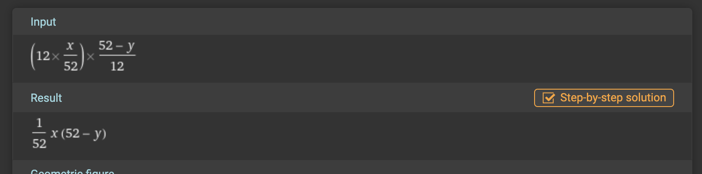

# Move in Rent Calculator

This project provides a simple web application that calculates the effective monthly rent, taking into account any weeks free offered by the landlord. It's a handy tool for renters looking to understand the actual cost of their lease over a year.

## Features

- **Rent Input**: Users can input the monthly rent amount.
- **Weeks Free Input**: Users can input the number of weeks free.
- **Effective Rent Calculation**: The application calculates the effective monthly rent considering the weeks free and displays it.

## How to Use

1. **Enter Monthly Rent**: Input the monthly rent amount in the designated field.
2. **Enter Weeks Free**: Input the number of weeks free offered in the lease.
3. **Calculate**: Click the "Calculate" button to see the effective monthly rent displayed below the button.

## Technical Details

The calculation is performed by a JavaScript function embedded within the HTML file. The formula used for the calculation is:

```javascript
var effectiveRent = (monthlyRent) * (52 - weeksFree) / 52;
```

This formula takes the monthly rent and adjusts it based on the number of weeks free, providing an annual cost that is then averaged back out to a monthly cost.

## Calculation source
`x` is monthly rent and `y` is weeks free.


## Setup
To run this project locally:

1. Clone the repository to your local machine.
1. Open the index.html file in a web browser.